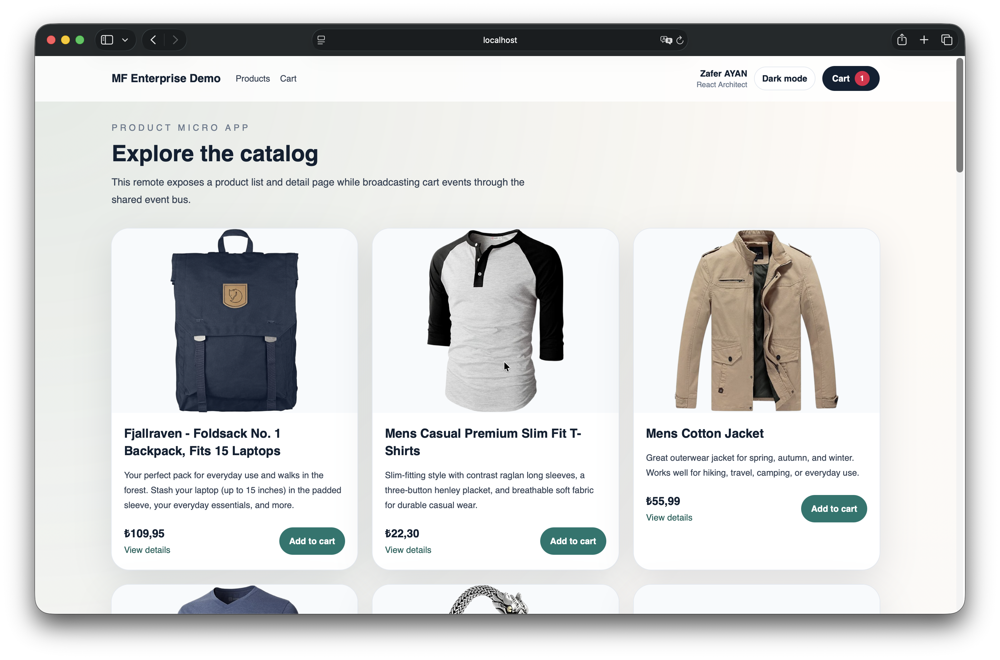

# mf-enterprise-demo

Webpack 5 Module Federation tabanlı bu demo, shell container ile iki remote microfrontend (`product`, `cart`) üzerinden basit bir e-ticaret deneyimi gösterir. Tüm uygulamalar TypeScript ile yazıldı ve ortak tipler, event bus, UI bileşenleri workspaces altında toplandı.

## Ekran Goruntusu



## Mimari Diyagram

```text
mf-enterprise-demo/
|- apps/
|  |- shell   (3000) -> host container, central routing, layout, theme, user state
|  |- product (3001) -> product list + detail, emits cart:add-item
|  \- cart    (3002) -> cart page, listens cart:add-item, emits cart:count-updated
|- packages/
|  |- shared  -> event bus, types, formatters, helpers
|  |- ui-kit  -> Button, Card, Badge, Skeleton, Toast, Modal
|  \- tsconfig -> shared TypeScript presets
\- tailwind.config.js -> shared styling tokens for all apps

Browser
   |
   v
Shell (localhost:3000)
   |-- consumes --> Product remoteEntry (localhost:3001)
   |-- consumes --> Cart remoteEntry    (localhost:3002)
   |
   \-- shares --> react, react-dom, react-router-dom, @mf-demo/shared, @mf-demo/ui-kit
```

## Kurulum ve Çalıştırma

```bash
npm install
npm run dev
```

Tek tek çalıştırmak için:

```bash
npm run dev -w apps/shell
npm run dev -w apps/product
npm run dev -w apps/cart
```

## GitHub Pages Deploy

Bu repo `main` branch'e push edildiğinde GitHub Actions ile otomatik olarak GitHub Pages'e deploy olacak. Workflow dosyasi: `.github/workflows/deploy-pages.yml`

Pages build'i lokalden almak icin:

```bash
npm run build:pages
```

Uretilen statik artifact `dist-pages/` altina yazilir.

GitHub Pages uzerinde shell uygulamasi `HashRouter` ile calisir; bu sayede SPA route'lari icin ek rewrite gerekmez. Beklenen URL formati:

- Shell: `https://zaferayan.github.io/microfrontend-demo/#/products`
- Product standalone: `https://zaferayan.github.io/microfrontend-demo/product/#/products`
- Cart standalone: `https://zaferayan.github.io/microfrontend-demo/cart/#/cart`

## Portlar ve URL'ler

- Shell: `http://localhost:3000`
- Product micro app: `http://localhost:3001/products`
- Cart micro app: `http://localhost:3002/cart`

## Module Federation Yapısı

- `apps/shell/webpack.config.js`: `name: "shell"`, `remotes` olarak `product` ve `cart` tanımlar.
- `apps/product/webpack.config.js`: `name: "product"`, `./App` remote modülünü expose eder.
- `apps/cart/webpack.config.js`: `name: "cart"`, `./App` remote modülünü expose eder.
- Tüm app'ler `react`, `react-dom`, `react-router-dom`, `@mf-demo/shared`, `@mf-demo/ui-kit` paketlerini `singleton` olarak share eder.

## Event Bus Akışı

```text
Product remote
  -> eventBus.emit('cart:add-item', payload)

Cart remote
  -> eventBus.on('cart:add-item', handler)
  -> own cart store updates
  -> eventBus.emit('cart:count-updated', { count })

Shell header
  -> eventBus.on('cart:count-updated', handler)
  -> updates cart badge
```

## Teknoloji Stack

- React 18
- TypeScript
- Webpack 5 + Module Federation Plugin
- React Router v6
- npm Workspaces
- Tailwind CSS
